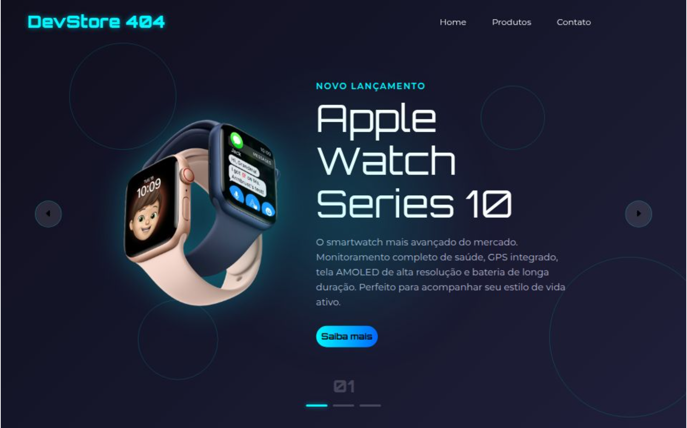

# **DevStore 404**

É uma vitrine fictícia de produtos da Apple, projetada com foco em animações dinâmicas e interatividade. O projeto simula uma loja online com carrossel de produtos, onde os usuários podem navegar por diversos itens, como o Apple Watch Series 10, Air Pods Max e o Apple Vision Pro.



## Funcionalidades

- **Carrossel de Produtos**: Navegue entre os produtos usando setas de navegação ou clique nos indicadores de pontos.
- **Animações Interativas**: O projeto apresenta transições e efeitos visuais suaves usando CSS e JavaScript.
- **Design Moderno**: Interface limpa com efeitos de foco, sombra e gradientes para uma aparência futurista.

## Tecnologias Usadas

- **HTML5**: Estrutura semântica do site.
- **CSS3**: Estilização, com ênfase em animações e transições.
- **JavaScript**: Funcionalidades interativas, como navegação no carrossel e controle do timer.
- **Fontes**: Utilização das fontes *Montserrat* e *Orbitron* para dar um estilo moderno e futurista.

## Estrutura do Projeto

```bash
.
├── index.html             # Página principal do site
├── styles.css             # Estilos principais da página
├── scripts.js             # Funções JavaScript para animações e interações
└── README.md              # Este arquivo


Feito com 💙 por Évila Oliveira


